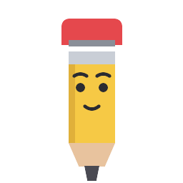

# Dash — Hermes Plugin

Dash, the pencil helper for Hermes — proactive assistant, original character.
Phase 1: the brain (observer + helpdesk). Phase 2 (animated pencil): later.



## Assets

- `assets/dash.svg` — source vector (edit this, then re-render PNGs)
- `assets/dash.png` / `dash-512.png` / `dash-64.png` — rendered PNGs

## Installation

1. Put the repo at `~/.hermes/plugins/dash/` (or `git clone` it there).
2. Restart Hermes. The plugin is auto-discovered.

## Usage

- `/dash <question>` — helpdesk for Hermes / Hermes Desktop
- Desktop: Dash is a floating window — drag it anywhere, click it to ask.
- Proactive: on repeated tool errors, Dash interjects with a tip.

## Config (optional)

```yaml
# ~/.hermes/config.yaml
plugins:
  entries:
    dash:
      allow_gateway_injection: true   # required for proactive messages in the gateway (Telegram/Discord)
      llm:
        allowed_models: []            # optionally restrict
```

## Behavior

- **Mood:** helpful → ironic on repetition.
- **Memory:** Dash remembers reported patterns (survives sessions).
- **Throttle:** max 5 messages/session, min 60s cooldown.
- **Fail-open:** Dash can never block the agent loop.
